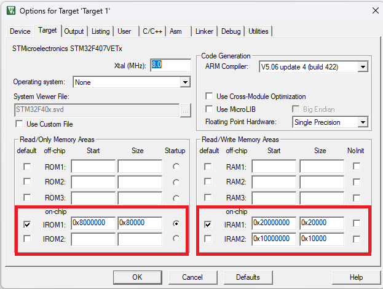

### Test Case Example(CE): 
# ARM cortex M4 assembly test on STM32F407

The CE contains a test assembly code which has several instructions and directives used in it. The code has few instructions for purpose of testing only. Instructions related to **function calls** and **stack operations** are also tested in the example. The source code is in the file _asm_test.s_. The **project references** are mentioned in the source file at it's end in the section `Refererences`.

Upon step-by-step debugging of the running code in STM32, we can observe the states of CPU registers.

The CE assumes the configuration of memory regions RAM and ROM for vector table placement is done by the user. It can be done through either Linker script or the IDE's settings like `"options for target..."` in Keil IDE.

The memory configuration (ROM , RAM) used in this example is as shown below. Keil IDEs `"options for target..."` was used for the same.

**Figure 1: Memory configuration (ROM , RAM)**

## Software (SW) Setup
- Tested with Keil uvision4 IDE: V5.22.0.0 (MDK522)
    - Device pack for STM32F407 in keil: STM32F4xx_DFP Version 2.14.0 (2019-07-24)
- Arm® Compiler V5.06

## Hardware (HW) setup
- <b>MCU used</b>: STM32F407
- <b>Development Board</b>: STM32 Black board with STM32F407VET6 onboard
- ST-Link utility HW for program code download to STM32 MCU

## Operation

Build and program the code into STM32 MCU, do step-by-step debugging to observe the states of CPU registers. 

  
---------------------------------------------------------
## Warning
The Software(s) assosciated and referred to in this repo, authored by ayushjain141 (Email: mr.ayush141@gmail.com) is intended to work in laboratory conditions only and are not tested for any security, safety and hazardous environment applications and is not intended to be used in any such cases. The referred software does not guarantee correct working in any safety-critical systems and in medical devices, the software should be used completely at user's risk only. In case of any form of failure or circumstances arising upon usage of this software the user is the only liable party and the author is not at all liable in any case. The referred software is liable to change without any notice to anyone and the author is not at all liable in any circusmtances arising because of these changes. For this or assosciated software, hardware and documents - any commercial logos, trademarks, copyrights, names and brands may be claimed as property of their respective owners.
